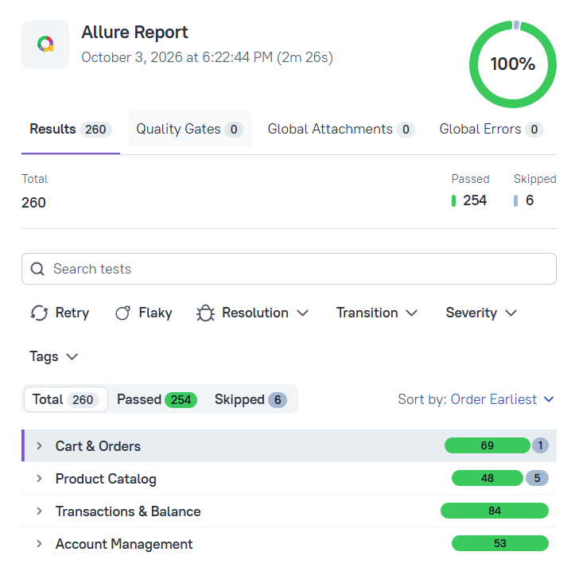

# Full-Stack Test Automation Framework
[](https://github.com/Eka-Sav/full-stack-qa-automation/actions/workflows/ci.yml)

This is a test automation framework that covers every layer of the application: API, database, 
UI, integration and end-to-end tests. It also includes an LLM-based pipeline that generates 
automated tests and test data. Every generated test goes through automated validation and manual review 
before it is added to the suite.

The framework tests an application that combines a marketplace and a fintech product. 
The application supports user registration, product purchase, deposits, and transfers between bank customers.

The project is split into two GitHub repositories: a public one with the test framework, 
and a private one with the application code. The application code is private, as it would be in a real company, and is available on request.

> **Latest results:** 260 tests: 254 passed, 6 xfailed (known bugs, see below). Allure shows the xfailed tests as "Skipped".
>
> **Allure report:** [view on GitHub Pages](https://eka-sav.github.io/full-stack-qa-automation/)



## Repository layout

| Repository | Visibility | Contents |
|---|---|---|
| `full-stack-qa-automation` (this one) | public | Tests, page objects, fixtures, test data, CI, Allure report |
| `full-stack-qa-app` | private | The application (FastAPI backend, React frontend, `docker-compose`) and the AI test-generation pipeline |

In CI, the private repository is downloaded with a read-only token, and the backend and frontend are started directly, without Docker. Read access to the private repository is available on request.

## Tech stack

- **Language and test runner:** Python, pytest
- **UI tests:** Playwright
- **API tests:** requests
- **Database checks:** PostgreSQL, SQL
- **AI pipeline:** Anthropic API (LLM)
- **Reporting:** Allure
- **Code quality:** Ruff
- **Infrastructure and CI/CD:** Docker, docker-compose, GitHub Actions, GitHub Pages

## Application under test

- **Backend:** FastAPI + SQLAlchemy (port 8005)
- **Database:** PostgreSQL
- **Frontend:** React (port 3000)
- **Domain:** users (one user = one account), products, cart and orders (`pending → confirmed → paid`, plus `cancelled`), transactions (deposit, payment), transfers between accounts

## Test layers

| Layer | Marker | What it checks |
|---|---|---|
| API | `api` | Endpoints: status codes, schemas, validation, state rules |
| DB | `db` | Data saved in the database: stored fields, schemas, validation |
| UI | `ui` | Browser: registration, login, cart and checkout, deposit and transfer, dashboard, what the page shows |
| Integration | `integration` | API + DB: a request is sent through the API, the result is verified in the database (balances, transactions, order status) |
| End-to-end | `e2e` | UI + API + DB: the user acts in the browser, the result is cross-checked between the UI, the API and the database |

Test types (they cut across the layers):

| Type | Marker | What it means |
|---|---|---|
| Smoke | `smoke` | One fast positive test per API endpoint: the service is alive and the main actions work |
| Negative | `negative` | Invalid input and forbidden actions: the test expects a rejection (400/404/422, "insufficient funds", "already cancelled") |
| AI-generated | `ai_generated` | Tests produced by the LLM pipeline that passed validation and manual review |

### End-to-end highlights

- **Money transfer (UI):** the test prepares users and a deposit through the API, then makes the transfer in the UI form. 
Before and after the transfer it compares five values between the UI and the database, for both the sender and the recipient: balance, total received, 
total spent, transaction count and the last transaction in the history. A second browser context is used for the recipient.
- **Product purchase (UI):** the test prepares a user, a deposit and a product through the API. In the UI it selects the product, adds it to the cart and pays, then checks the order in the orders list. 
Before and after the purchase it compares six values between the UI and the database: balance, total received, total spent, transaction count, the last transaction in the history and the orders list. This test was generated by the LLM pipeline.

## Project structure

| Path | What it is |
|---|---|
| `tests/api`, `tests/db`, `tests/ui` | Tests by layer |
| `tests/e2e/Integrations`, `tests/e2e/UI` | End-to-end scenarios (API + DB and full-stack) |
| `pages/` | Page objects (login, dashboard, products, cart, orders, transactions) |
| `api/` | API client and endpoints |
| `database/` | DB manager: direct SQL access used by the DB, integration and E2E tests |
| `data/` | Test data, including AI-generated edge-case products |
| `utils/` | Logger |
| `config/` | Settings loaded from `.env` (backend, frontend and database URLs, timeouts) |
| `conftest.py` | Fixtures (in the root and in `tests/`) |
| `pytest.ini` | pytest settings and registered markers |
| `requirements.txt` | Dependencies |
| `ruff.toml` | Linter settings |
| `allurerc.json` | Allure report settings |
| `.env.example` | Template for the local `.env` file (backend, frontend and database URLs) |
| `.github/workflows/` | CI pipeline (GitHub Actions) |

Fixture naming: `xxx_data` is the raw payload sent to the API, `created_xxx` is the server response. Test names follow `test_<action>_<check>_<field>_returns_<code>`.

## Getting started

The tests run against the application, which lives in a private repository. Without access to it you can read the code, the Allure report and the CI results, but not run the suite.

Requirements:

- Python
- Docker
- Node.js (for the Allure report)
- the application repository, cloned next to this one

Commands are given for Windows PowerShell.

```powershell
# 1. In both repositories, copy the template to .env
#    (if you change the database password, change it in both files)
copy .env.example .env

# 2. Start the application (from the application repository, with Docker Desktop running)
docker-compose up -d --build
docker-compose ps                     # all containers should be running
# open http://localhost:8005/health   # {"status": "ok"} means the application is up

# 3. Set up the tests (from this repository)
python -m venv .venv
.venv\Scripts\Activate.ps1
pip install -r requirements.txt
playwright install chromium

# 4. Run the tests
pytest                      # everything
pytest -m "api or db"       # selected layers
pytest -m "smoke"           # smoke only
pytest -m "not negative"    # positive cases only
```

Configuration is read from `.env` (database credentials and base URLs).

**Warning:** the tests wipe the database from `DATABASE_URL` at the start of every run, so point it only at a test database.

Tests stay isolated from each other through unique test data.

## Reports and CI/CD

### Allure report

Allure 3 is installed separately from the Python dependencies: it needs Node.js (`npm install -g allure`). During a test run the `allure-pytest` plugin writes raw data to `allure-results`. Build and open the report from it:

```powershell
Remove-Item -Recurse -Force allure-report -ErrorAction SilentlyContinue
allure awesome ./allure-results --group-by "epic,feature,story" --output allure-report
allure open allure-report
```

The first command removes the previous report: otherwise the old one opens. Tests are grouped as epic → feature → story: Account Management, Product Catalog, Cart & Orders, Transactions & Balance. Failure screenshots and stdout are attached automatically.

### CI

The pipeline runs on GitHub Actions on every push to `main`, on pull requests and manually. It has three jobs:

1. **lint** - static check of the code with `ruff`.
2. **tests** - runs only if lint passed, as two parallel suites: `backend` (`api`, `db`, `integration`) and `ui` (`ui`, `e2e`). Both start a PostgreSQL service, download the private application repository with a read-only token and start the backend. The `ui` suite also builds and starts the frontend and installs a Playwright browser. 
3. **allure-report** - on `main` only, even if some tests failed: merges the results of both suites into one Allure report and publishes it to GitHub Pages.

CI does not use Docker. 

## AI-assisted testing

Part of the tests and test data is generated with an LLM pipeline. The pipeline code is in the private repository and is available on request.

```
gather_context → build_prompt → call_api → extract_code → validate → generate_test
```

1. **gather_context** - reads example tests, `conftest.py`, endpoints, `DBManager`, page objects and product data.
2. **build_prompt** - builds the prompt from that context and the task text, with a separate system prompt for each scenario type.
3. **call_api** - sends the prompt to the model and retries on errors.
4. **extract_code** - takes the code out of the model's answer.
5. **validate** - automated checks (see below).
6. **generate_test** - runs all steps and saves the draft outside the suite, where it waits for manual review.

Only drafts that pass validation and manual review are moved into the suite. They get the `ai_generated` marker.

### Validation

Every draft goes through automated validation before a human sees it. The checks go from cheapest to most expensive and stop at the first failure:

- the code parses without syntax errors;
- the test has at least one assertion and no trivial `assert True`;
- every fixture the test uses exists in `conftest.py` or is built into pytest / Playwright;
- every `DBManager` method called on the `db` fixture actually exists;
- `ruff` finds no lint errors;
- optionally, the draft is run with `pytest` (off by default, because it needs the application and the database to be up).

The checks catch typical LLM mistakes, such as invented fixtures and methods that do not exist. They only show that the test is technically correct, not that it checks the business logic properly, so manual review is still needed.

### Edge-case test data

The model also generates 11 edge-case products (very long names, emoji, injection strings, digits-only names, empty or null descriptions, invalid categories, etc.). The output is checked and saved as a JSON file, and the tests take their test cases from it.

These tests were first run without `xfail` to get a real red result. Only the cases that really failed were then marked `xfail`.

## Known bugs

These bugs are covered by `xfail` tests and are left unfixed on purpose, so the report shows them.

- `description` has no validation: empty, null, very long and injection strings (XSS/SQL) are accepted with `201`.
- A product name made only of whitespace is accepted with `201`.
- **Cart payment is not atomic:** the UI calls `PATCH /confirm` and then `POST /pay`. With insufficient funds the order stays `confirmed` although the payment failed, and a second attempt shows "Order is already confirmed".

These three bugs account for the 6 `xfailed` tests in the report.

## Known limitations

- No stock tracking: more items can be bought than are available. On a real project this would be raised at requirements review.
- No server-side pagination or sorting on `GET /products` (client-side only).
- Cascade deletion is not configured in the models.
- Price upper bound is not validated.
- `POST /transfers` response has no `created_at` (inconsistent with `/transactions`).

## Possible improvements

- CLI parameters (`--scenario`, `--task-file`, `--output`) for the test generator instead of constants in code
- Each repository currently has the same full list of dependencies; split it so the backend installs only its own packages and gets a smaller Docker image
- Migrate the frontend from Create React App to Vite
- AI-assisted assertions and failure analysis
